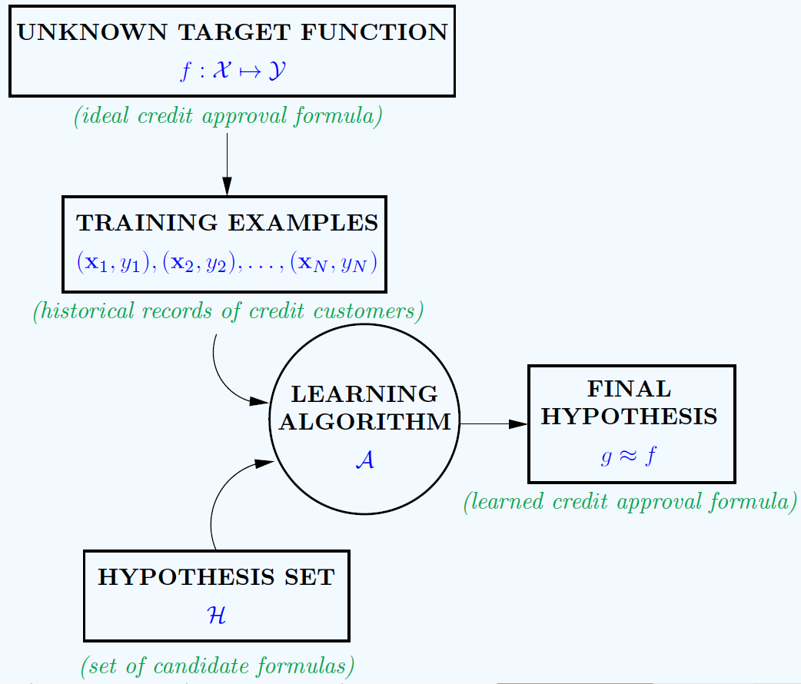

# Statistical-Machine-Learning-AIM-102-2026
This is the official repository for all codes provided as a part of the tutorial for the course AIM 102, in the year 2026

## Week 1: Introduction and Regression
We look at linear (single and multivariate) regression, and look at polynomial regression. We introduce basics of Supervised Learning.

